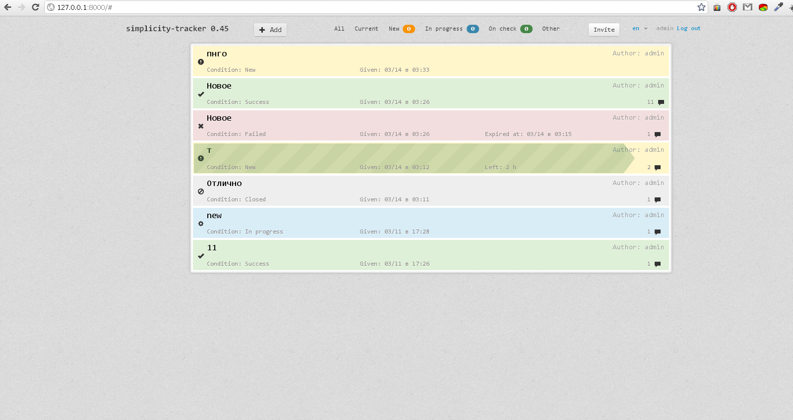

Simple issue/task tracker that allows to manage issues, to set runtime for the task, and discuss it. Invites to users can be sent by superusers.
Built on Django-1.4 and Bootstrap.css and jquery.
#### Dependencies:
 - django-markitup (https://github.com/carljm/django-markitup.git)

Examples:
=========
 1. ##### Wide screen.

 
 2. ##### Responsive view.

  